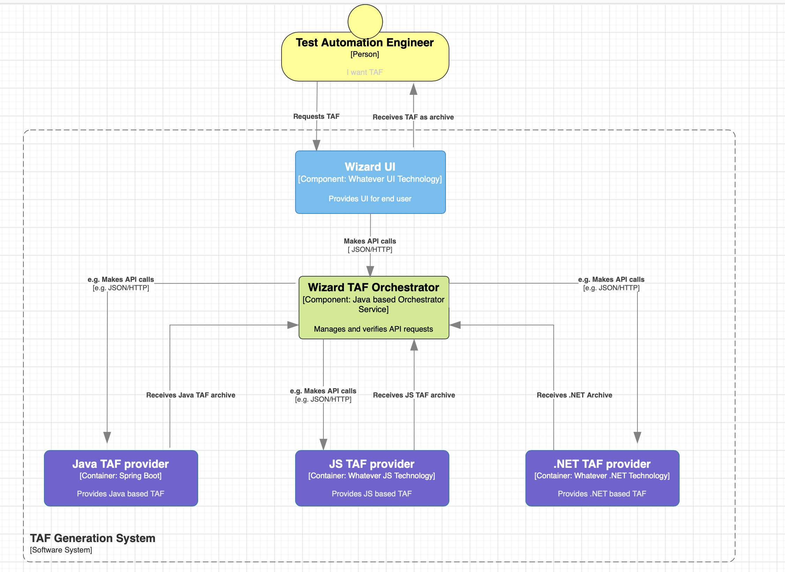
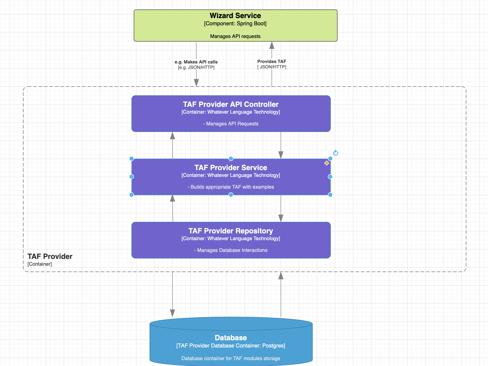

# Wizard project (taf generation system) - Architecture

* Status: accepted
* Date: 12-08-2023

## Problem

Currently, we need to define architecture and delivery flow across language platforms (Java, JS, .NET, Python)

## Requirements

* The system should be able to deliver Test Automation frameworks for different language platforms
* The system should be able to deliver examples and best practices for each language platform
* The system should provide possibility to develop each language platform independently to use all the power or language without limitation
* The system should provide to add/update test automation modules in the least amount of time
* The system should provide possibility for seamless integration for any new language platform
* The system must be resilient to transient failures
* Generated code should be compilable and ready for execution in corresponding environment for every language
* The system should be able to deliver best practices based on examples and documentation
  
## Option: Microservice architecture (TAF Orchestrator + Language platform TAF providers)
### Overall diagram

### TAF Orchestrator diagram

### TAF Provider diagram

#### Pros

* Each language platform is independent
* Easy integration of language platform

#### Cons

* Need to maintain Http servers for each language platform provider and at least one database

